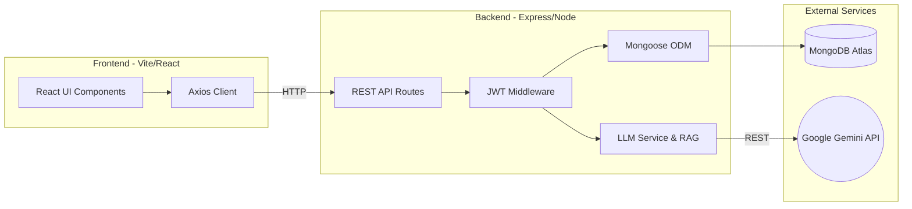

# LOOP - AI Customer-Feedback Intelligence Platform

*A Full-Stack AI Application developed for University Faculty Review*

**LOOP** is a next-generation AI command center designed for modern B2B SaaS teams. It centralizes customer feedback across channels, uses LLM-powered pipelines to classify and extract actionable insights, and provides beautiful, dark-themed analytics alongside a conversational Natural Language interface (RAG) to query customer data.

## 🎯 Problem Statement & Innovation
Customer feedback is typically scattered across support tickets, app store reviews, and sales calls. Traditional platforms require manual tagging and offer static dashboards. 

**LOOP** solves this by automating the ingestion and insight-generation process:
1. **Automated AI Pipelines**: Uses Google Gemini's Structured Outputs for deterministic JSON classification, extracting sentiment and product themes with zero manual intervention.
2. **Semantic Knowledge Base (RAG)**: Uses `text-embedding-004` to vectorize feedback, allowing product managers to "chat" with their customer data via **Ask LOOP**.
3. **Advanced Concurrency Control**: Implements robust database-level Upsert Locks and sequential background processing to handle bulk CSV ingestion without hitting LLM rate limits or race conditions.
4. **Premium UX**: A motion-rich, futuristic UI inspired by premium tools like Linear, built from scratch without bloated component libraries.

## 🛠️ Architecture & Tech Stack (MERN + Vite)
We utilized a highly-scalable, decoupled MERN architecture to support flexible NoSQL document structures and high-performance frontend rendering.

- **Frontend**: React 18, Vite, TypeScript, Tailwind CSS, Recharts
- **Backend**: Node.js, Express, TypeScript, Mongoose
- **Database**: MongoDB Atlas (Cloud)
- **AI Models**: Google Gemini (`gemini-flash-lite-latest`) & Vertex AI Embeddings



## 🚀 Local Setup & Review Guide

### 1. Prerequisites
- Node.js (v18+)
- MongoDB Atlas cluster (Database Link ready)
- Google Gemini API Key

### 2. Clone and Install
```bash
git clone <repository_url>
cd loop

# Install Backend dependencies
cd server
npm install

# Install Frontend dependencies
cd ../client
npm install
```

### 3. Environment Variables
The necessary `.env` files have been placed in both the root `loop/` directory and `loop/server/` directory, containing the secure MongoDB Atlas connection string and Gemini API keys.

### 4. Database Seeding (Demo Initialization)
To instantly populate the cloud database with a rich set of categorized feedback, themes, and users for the faculty review:

```bash
cd server
npm run seed
```

This automated script will:
- Safely clear existing collections.
- Create 3 role-based users (Admin, Analyst, Viewer).
- Establish predefined product themes.
- Insert 150+ varied feedback items and dynamically classify them.
- Generate an initial Executive Insights Report.

### 5. Run the Application
In one terminal, start the backend server:
```bash
cd server
npm run dev
```

In another terminal, start the frontend Vite client:
```bash
cd client
npm run dev
```

The application will be available at `http://localhost:5173`.

## 🔐 Demo Credentials

You can log in to the demo workspace using the following credentials seeded in step 4. *(Sign-up is disabled in this preview to preserve workspace integrity).*

| Role | Email | Password | Permissions |
| :--- | :--- | :--- | :--- |
| **Admin** | `admin@acme.com` | `Demo1234!` | Full access. Manage users, edit feedback statuses, generate reports. |
| **Analyst** | `analyst@acme.com` | `Demo1234!` | Can view/edit feedback statuses, run Ask LOOP queries, view reports. |
| **Viewer** | `viewer@acme.com` | `Demo1234!` | Read-only access to dashboards and reports. |

---
*Developed for University Capstone/Showcase Evaluation.*
